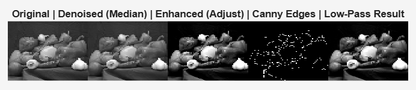

# DSP Image Processing Pipeline – Lab 6 Mini Project

> **Goal:** Combine *filtering*, *frequency-domain processing*, *edge detection*, and *contrast enhancement* into a single reproducible MATLAB pipeline.

---

## 1. Processing Pipeline

The script processes a grayscale image through **five sequential stages**:

| Step | Operation | MATLAB Function |
|------|-----------|-----------------|
| 1 | **Load & convert** to double `[0,1]` | `im2double(rgb2gray(imread(...)))` 
|
| 2 | **Denoise** – remove salt-and-pepper noise | `medfilt2(I, [3 3])` |
| 3 | **Enhance contrast** – stretch intensity range | `imadjust(I_filt, [0.2 0.8], [0 1])` |
| 4 | **Edge detection** – extract strong boundaries | `edge(I_enh, 'Canny', [0.1 0.25])` |
| 5 | **Frequency-domain low-pass filtering** – remove high-frequency noise | Ideal circular mask (`radius = 60`) → `fft2`, multiply, `ifft2` |

**Output:** A montage of **Original → Denoised → Enhanced → Edges → Low-Pass Result**.

---

## 2. Relation to DSP Concepts

| Stage | DSP Principle | Explanation |
|-------|----------------|-----------|
| **Median filter** | **Non-linear spatial filtering** | Order-statistic operation; robust to impulsive noise, preserves edges better than linear averaging. |
| **Contrast stretch** | **Point processing / intensity mapping** | Non-linear transformation of pixel values; modifies histogram without spatial interaction. |
| **Canny edge detector** | **Linear high-pass + non-linear thresholding** | Uses Sobel kernels (convolution), non-maximum suppression, and hysteresis – classic multi-stage DSP chain. |
| **Low-pass mask** | **Frequency-domain multiplication = circular convolution** | `H(u,v)` × `F(u,v)` → filtered image (convolution theorem). Demonstrates ideal brick-wall filter. |

---

## 3. Improvements & Limitations

| Aspect | Limitation | Suggested Improvement |
|--------|------------|-----------------------|
| **Median filter** | May blur fine textures | Use **bilateral filter** or **non-local means** for edge-preserving denoising. |
| **Contrast stretch** | Global → can saturate regions | Apply **CLAHE** (adaptive histogram equalization). |
| **Canny thresholds** | Fixed factors `[0.1 0.25]` | Compute automatically via Otsu or percentile-based scaling. |
| **Ideal low-pass** | Causes **ringing (Gibbs phenomenon)** | Replace with **Butterworth** or **Gaussian** filter (smooth roll-off). |
| **Pipeline rigidity** | Hard-coded parameters | Add GUI (`uicontrol`) or config file for radius, thresholds, etc. |

---
